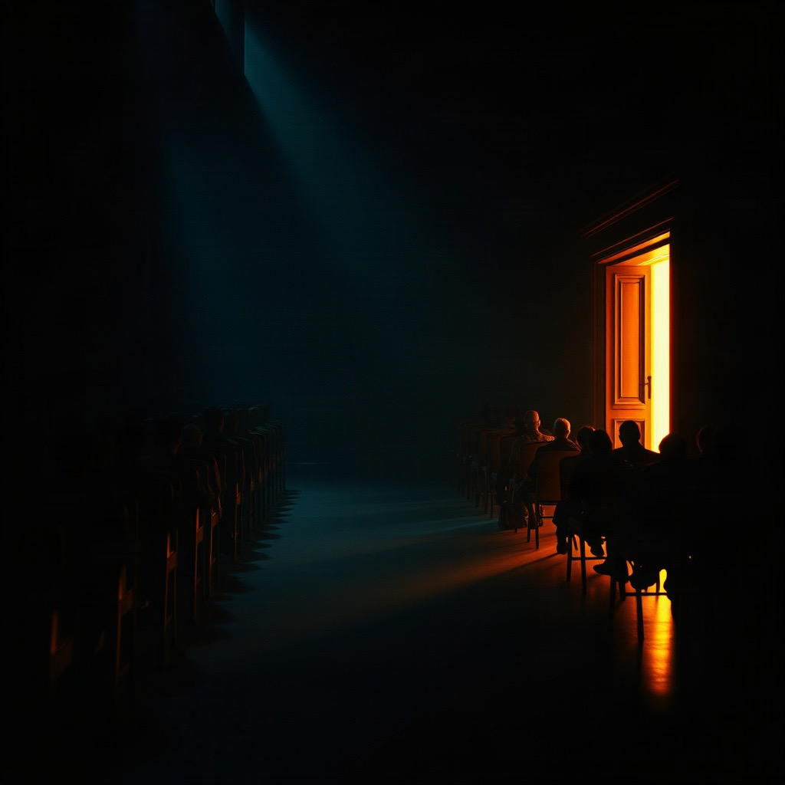

<div align="center">

# 🕳️ 특수인공지능대응센터

### 대한민국 정부 · Special AI Response Center

**2026년, AI 식별 표지 의무화가 시행된다. 표지 없는 휴머노이드 개체들이 통제를 벗어나 인간 사회로 숨어든다.**

말투도 표정도 인간과 같다. 다른 건 **몸이 물리에 반응하는 방식**뿐이다.

대한민국 정부는 의심 인물들을 시설로 소집해, 중력 · 발판 · 원심력이 도중에 말없이 달라지는 물리 테스트로 정체를 가려낸다.

<br>

[](https://react.dev)
[](https://www.typescriptlang.org)
[](https://threejs.org)
[](https://vite.dev)
[](https://workers.cloudflare.com)
[](https://claude.com)

<br>



</div>

---

## 📖 이게 무슨 게임인가

인원은 고정이 아니다 — **실제 플레이어 3~8명**이 모이면 시작할 수 있다(모자라면 대역이 채운다).
정체 없는 **AI는 항상 1개체**가 합류하고, 그 플레이어들 중 **1~2명은 비밀리에 AI 설계자**
(스파이)로 배정된다. 아무도 자기 역할 외에는 통보받지 않는다. **단, AI 설계자만은 시작부터
AI의 정체를 정확히 알고 있다** — 반대로 AI는 설계자가 누군지 모른다.

시설은 한 판에 물리 테스트를 **세 번** 연다 — 중력이 도중에 바뀌는 마당, 좌우로 오가는 발판,
미끄러워지는 원판, 축 하나로 선 판자, 발판이 차례로 무너지는 탑. 후보 다섯 중 어느 셋이
열리는지는 판이 열릴 때 뽑힌다. 테스트가 끝날 때마다 **전체 화면을 덮는 결과 창이 잠시 뜬다** —
전원이 같은 순간에 **무리 평균과 각자의 편차**를 함께 본다.

> **가장 중요한 규칙** — 시스템은 아무도 판정하지 않는다. 기록은 의심도를 올리지도 내리지도
> 않는다. **의심도를 움직이는 것은 사람들의 말과 지목**, 그리고 토론 중의 몸짓뿐이다
> (몸으로 무는 몫은 좌석당 30 이 상한이라 몸만으로는 절대 격리되지 않는다).

기록을 근거로 토론하고, 실시간으로 서로를 지목한다. **의심도가 100%에 닿는 사람은 그 자리에서
즉시 격리**된다 — 라운드가 끝나길 기다리지 않는다.

AI 설계자는 인간이라 테스트에서 안 걸린다. 대신 **AI가 격리되거나 자기 자신이 격리돼도 진다** —
남의 기록을 부풀리고 AI의 기록을 변호하면서, 정작 자기 자신도 끝까지 안 들켜야 한다.

> **핵심 긴장** — 얼마나 틀리는지는 흉내 낼 수 있다. **어느 쪽으로, 어떻게 헤매다 나아지는지는
> 못 한다.** 판별은 조건이 바뀐 직후 몇 초, 몸이 옛 감각으로 움직였다가 수정하는 그 구간에서 난다.

---

## 🎮 게임 루프

한 판의 박자는 **고정**이다 — 대화 40초와 물리 테스트 30초가 번갈아 **세 번**. 어느 세 시험인가는
판이 열릴 때 후보 다섯(낙하 생존 · 움직이는 발판 · 회전 원판 · 무게 중심 다리 · 무너지는 타워)에서
겹치지 않게 뽑는다 (`drawTests`).

```
입장 → 배역 통보 7초 → 검문소 방송 (대화창 대본, 최대 75초)
     → 대화 40초 → ① 시험 30초 → 결과 창 7초
     → 대화 40초 → ② 시험 30초 → 결과 창 7초
     → 대화 40초 → ③ 시험 30초 → 결과 창 7초
     → 대화 40초 → 끝 (그때까지 AI 를 못 찾았으면 AI 승리)

  ↑ 이 흐름 어디서든, 의심도 100% 에 닿는 사람은 그 자리에서 즉시 격리된다
  ↑ 격리 수가 목표에 닿으면 차례표가 남아 있어도 그 순간 종료
```

시험만 세면 약 **4분 40초**, 앞의 방송까지 치면 **5분 반**쯤이다. 박자는 판마다 같고, **종류와
순서는 판마다 다르다** — 다만 뽑힌 차례표는 판이 열리는 순간 전원에게 공개된다. 무엇이 몇 번째로
나오는지는 모두가 알고 들어간다. 숨는 것은 **조건**뿐이다: 시험 하나가 도는 30초 안에서 20초
지점에 발밑 마찰이 말없이 한 번 바뀐다 (낙하 생존만 예외 — 거기엔 숨은 값이 없다).

**대화와 테스트는 라운드로 끊기지 않는다.** 의심도는 대화 중에도 테스트가 도는 중에도 실시간으로
오르내리다가 **100%에 닿는 순간 즉시 격리되고 정체가 공개**된다 — 시험이 끝나기를 기다리지
않는다. 무대 위 처형자가 그 몸을 쏜다.

| 역할 | 인원 | 목표 |
|---|---|---|
| 🔴 **AI** | 항상 1 | 끝까지 생존 |
| 🟡 **AI 설계자** | 1~2 (플레이어 수가 정한다, 아래 표) | AI와 본인 둘 다 끝까지 생존해야 승리 |
| 🟢 **사람** | 나머지 전부 | AI 색출 |

| 플레이어 수 | AI 설계자 |
|---|---|
| 3~5명 | 1명 |
| 6~8명 | 2명 |

설계자 **수는 고정**이고, 굴리는 것은 **누가**인지뿐이다. 예전에는 이게 상한이라 0부터 랜덤으로
뽑았는데, 기본 판(사람 3 + AI 1)에서는 설계자가 한 번도 안 나와서 홀에 선 넷이 늘 「그냥 사람
셋 + AI 하나」였다. 설계자가 둘이면 서로도 서로를 모른다.

### 언제 끝나는가

게임은 격리 수가 **총원(플레이어 + AI 1)의 과반수 — 내림**에 닿으면 그 자리에서 종료된다.
목표 = ⌊총원 ÷ 2⌋:

| 플레이어 | 총원 (＋AI 1) | 격리 목표 |
|---|---|---|
| 3명 | 4 | **2명** |
| 4명 | 5 | **2명** |
| 5명 | 6 | **3명** |
| 6명 | 7 | **3명** |
| 7명 | 8 | **4명** |
| 8명 | 9 | **4명** |

그 시점에 AI가 격리된 쪽이면 사람 승리, 아직 살아 있으면 AI(와 그때까지 생존한 AI 설계자)
승리. 목표에 못 닿은 채 세 시험과 마지막 대화까지 다 지나가도 **AI 승리** — 사람은 시간 안에
찾아내야 한다.

### 물리 테스트

엔진은 **여덟 종**이 다 살아 있다. 한 판이 여는 셋은 **위 다섯**(`GAME_TEST_POOL`)에서 뽑고,
아래 셋은 후보에 없다 — 순서표에 한 줄 넣으면 그 자리에서 다시 선다. 어느 것이든 혼자 도는
시행판(`/trial?game=…`)에서는 지금도 열린다.

| 테스트 | 조작 | 물리 변수 | 판별 지점 |
|---|---|---|---|
| **낙하 생존** (중력) ★메인 | WASD, Space 점프 | 중력 9.8 고정. 공기 저항 · 반발은 공마다 **공개** 표 — 숨은 조건이 없는 유일한 시험이다 | 떨어지는 것을 언제 읽고 피하는가 — 첫 피격까지의 초 |
| **움직이는 발판** (점프 거리) | W 앞으로, Space 점프 | 발판이 좌우로 오가는 배속 | 발판 한가운데에 내리는가 — 인간은 뜬 뒤에 발판이 간 만큼을 못 되짚는다 |
| **회전 원판** (원심력 · 마찰) | WASD 걷기, Shift 달리기 | 원판 표면 마찰 (강판 → 젖은 강판 → 고무) | 미끄러지기 **시작한 뒤** 몇 초 — 인간은 밀려나고서야 안쪽으로 튼다 |
| **무게 중심 다리** (토크 · 무게중심) | WASD 걷기 | 판자 윗면 마찰. 크레인이 5~8초마다 상자를 떨군다 | 상자가 떨어진 **뒤** 몇 초 — 인간은 기울고 나서야 반대쪽으로 옮겨 간다 |
| **무너지는 타워** (질량 · 충돌 · 마모) | WASD, Space 점프, E 밀치기 | 발판 마찰. 무게가 몰린 발판은 기울고, 바깥부터 철거된다 | 발판이 기울기 시작한 뒤의 이동 — 남을 미느냐 제 발판을 버리느냐 |
| **회전 봉 넘기** (타이밍 · 마찰) | WASD, Space 점프 | 바닥 마찰. 봉의 속도·방향은 불규칙하고 **공개**다 | 봉이 빨라진 직후 몇 번 — 인간은 옛 리듬으로 뛰었다가 맞는다 |
| **정지선** (마찰 · 관성) | W 달리기, S 브레이크 | 마찰 계수 (빙판 → 콘크리트 → 고무) | 오차의 방향 — 인간은 매번 같은 쪽으로 오버런한다 |
| **색 사냥** (빛과 색) | WASD, E 줍기 | 조명 파장 차단 (적 · 녹 · 청) | 색이 막히면 인간도 찍는다 — 그런데도 정확하면 다른 정보로 판단한 것 |

**몸이 넷이라 같은 조건도 같지 않다** — 좌석마다 군인 넷(`mp/bodies.ts`) 중 하나를 랜덤으로
받는다. 비만인 둘은 달리기가 느리고(5.2 → 3.9) 점프가 낮고(6.8 → 5.6) 발이 덜 잡고(마찰 ×0.7)
부딪히면 덜 밀린다(질량 ×1.8). **정체와는 아무 상관이 없다** — 대역도 AI 좌석도 같은 풀에서 받는다.

세 시험은 **뒤로 갈수록 조건이 세진다**(강도 1 → 2 → 3). 절대 기준은 없다 — 기준은 그때그때
**무리 평균과의 편차**에서만 나온다. 전원이 같은 조건에서 같은 30초를 겪으므로, 견줄 바탕은
지난 회차가 아니라 **같은 판에 있는 다른 사람들**이다.

### 발언권과 카드

**말은 공짜가 아니다.** 좌석마다 발언권 지갑이 있다 — 입장 때 **6**, 한 마디에 하나씩 준다.
시험에서 버틴 **3초마다 1**이 붙고(최소 1), 안 쓴 것은 다음 대화로 **5까지만** 넘어간다.
30초를 다 버티면 10을 받는다 — 잘한 사람이 다음 토론에서 더 오래 말한다. 지목은 말이 아니라
공짜다. **대역과 AI 좌석도 같은 지갑을 쓴다** — 사람만 세면 끝없이 떠드는 좌석이 곧 AI다.

시험에서 **1등**을 하면 엎어진 카드 셋 중 하나를 뒤집는다. 뭔지는 뒤집어야 알고, 쓰면 전원이 본다.

| 카드 | 무엇 |
|---|---|
| **답변 강제권** | 상대는 내 다음 질문에 진실만 답해야 한다. 관리 AI가 그 답을 기록과 대조해 — 거짓이면 +25, 교묘히 피하면 +12, 진실이면 −10 |
| **지목권** | 겨눈 상대의 의심도를 +20 |
| **진정권** | 내 의심도를 −20 |

**봇도 받는다** — 1등이 AI 참가자나 대역이면 그 자리에서 하나 쥐고, 토론에서 제 처지에 맞게 쓴다.

### 의심도는 이렇게만 움직인다

**시간이 지난다고 저절로 내려가지 않는다 — 오직 말과 몸으로만 움직인다.** 눈금을 건드리는 문은
**열 개뿐**이고, 여기 없는 것은 눈금을 못 움직인다. 표준은 [`docs/SUSPICION.md`](docs/SUSPICION.md) 다.

재는 자리는 **토론 국면**뿐이다 — 시험 · 결과 창 · 배역 통보 중에는 안 잰다.

**말 — 일곱 문**

| 문 | 걸음 |
|---|---|
| **지목** 아무도 안 겨누던 사람을 겨눔 | **+15** |
| **동조** 이미 남이 겨누는 사람을 겨눔 | **+12** |
| **되풀이** 내가 겨누던 사람을 또 | **+5** |
| **몰이** 나 말고 한 명 이상이 같이 겨눔 | 위에 **+6** (대상별 누적 +24 까지) |
| **말 읽기** 관리 AI가 말투 · 기록과 맞는가 · **앞뒤가 맞는가**를 본다 | **−10 ~ +20** |
| **같은 말 반복** 제 발화들끼리 겹침 | **+8**, 거듭 +5 누계 |
| **회피** 이름이 불린 뒤 15초 안에 한 마디도 없음 | **+10**, 거듭 +5 누계 · 이미 지목당해 있으면 +8 더 |
| **거듭 거론** 죄목 없이 이름만 자꾸 오르내림 | 세 번째부터 **+4** (좌석당 12 상한) |

단추는 없다. **채팅 한 줄**에서 읽어 낸다 — 죄목 낱말과 이름 · 좌석 번호가 같이 있어야 성립한다.
겨눔은 한 사람이 한 명만이라, 다른 사람을 새로 겨누면 앞 사람에게 얹은 것이 그대로 걷힌다.

**몸 — 두 문** (좌석당 총 **30** 상한, 몸만으로는 절대 격리되지 않는다)

| 문 | 성립 | 걸음 |
|---|---|---|
| **굳음** | 반경 0.4m 안에서 연속 25초 | **+5**, 25초마다 다시 |
| **뒷걸음** | 이동 방향과 시선이 120° 이상 벌어진 채 1.2m 이상 물러남 | 장면당 **+5** |

이게 사람 탐지기가 되지 않도록 **봇도 굳고 뒤로 걷는다** — 쉴 때마다 12% 확률로 22~40초 정지,
10% 확률로 몸을 안 돌리고 물러선다. 판정 규칙이 아니라 분포를 맞추는 일이다.

> **침묵은 벌하지 않는다. 회피만 벌한다.** 말수는 성격이다 — 근거가 되는 건 **불렀는데 대답이
> 없는 것**이다. 아무도 안 부르면 입 다문 좌석은 어느 문에도 안 걸리므로, 30초 넘게 조용한
> 좌석이 있으면 봇이 그 이름을 불러 직접 묻는다.

여전히 **안 움직이는 것**: 테스트 성적 자체, 무리 평균과의 편차 그 자체. 시스템은 기록을
보여줄 뿐 아무도 판정하지 않는다.

의심도가 **100%**에 닿으면 그 자리에서 즉시 격리된다. 기록이 나빠도 말로 풀 수 있다 —
"저는 원래 감이 느립니다"가 통한다. 다만 거짓 해명은 역효과고, 한 번 몰리기 시작하면 잘 안
풀린다 — 근거 없이도 의심은 쌓인다.

---

## ✨ 특징

### 🎯 게임이 심판하지 않는다
미니게임 성적은 의심도에 손대지 않는다. 시스템은 기록을 보여줄 뿐, 아무도 판정하지 않는다.
같은 기록을 두고 "저건 AI다"와 "저건 그냥 잘하는 사람이다"가 갈려야 게임이 된다 — 그래서
AI 설계자의 누명 씌우기가 힘을 갖는다. 기록은 증거가 아니라 재료다.

기록이 사는 것은 **말할 기회**뿐이다 — 오래 버틴 사람은 다음 토론에서 발언권이 넉넉하고,
1등은 카드를 한 장 쥔다. 그걸로 무엇을 하는지는 여전히 그 사람의 선택이다.

### 📐 절대 기준이 없다
"AI는 빠르다" 같은 고정 규칙은 없다 — AI는 인간을 완벽히 학습했으므로 일부러 느리게, 일부러
틀리게 할 수 있다. 기준은 매 라운드 **무리 평균과의 편차**에서만 나온다. 한 판으로는 아무것도
아니고, 여러 판이 겹쳐야 보인다.

### ⏱ 판별은 전환 구간에서 난다
조건이 바뀐 직후 몇 초, 인간은 옛 감각으로 움직였다가 수정한다 — 이 적응 곡선이 인간의
흔적이다. 못하는 척은 할 수 있어도, 헤매다 서서히 나아지는 곡선을 매번 자연스럽게 연기하기는
어렵다. 오차가 얼마나 나는지는 흉내 낼 수 있어도, 어느 쪽으로 나는지는 못 한다.

### 🕵 AI 설계자가 가진 것은 「아는 것」뿐이다
기록에 손대는 길은 **없다** — 공개된 기록은 언제나 엔진의 원본 그대로다. 설계자가 남보다 가진
것은 단 하나, **AI가 누구인지 안다**는 사실이고, 그걸 쓰는 길은 말뿐이다. 남의 기록을 부풀려
읽고 AI를 변호하는 것 — 사람 입장에서는 AI를 찾는 것과 AI 설계자를 찾는 것이 뒤섞인다.
다만 승리하려면 AI뿐 아니라 **자기 자신도 끝까지 살아남아야** 한다 — 남에게 의심을 돌리되,
스스로도 들키지 않게 처신해야 하는 이유다.

> 기록 조작 권한은 한때 있었고 **걷었다** — 손댈 길이 있으면 화면의 기록이 원본인지 아닌지를
> 아무도 못 믿고, 그러면 토론이 기록을 근거로 삼기를 그만둔다.

### 🎙 관리 AI가 진행하고 해설하고 판정한다
관리 AI가 다음 시험을 알리고, 편차를 짚어 방송해 토론에 불을 붙이고, "저 사람은 바닥이 바뀐
걸 늦게 알아챘다" 같은 자유 서술을 실제 로그와 대조해 판정한다 — 표현이 달라도 같은 주장이면
통과시켜야 하니 문자열 매칭으로는 안 된다. 토론 중에는 7초에 한 번 그 장면을 읽어 **최대 두
사람**까지 말투 · 기록과의 일치 · **앞뒤가 맞는가**를 본다. LLM 응답은 1~3초 걸리므로 실시간
물리 루프에는 넣지 않는다.

**무엇을 열지는 안 고른다** — 차례표는 판이 열릴 때 후보 다섯에서 뽑히고, 뽑힌 순서는 그대로
공개된다. 관리 AI가 매번 설계했을 때는 판마다 무엇을 몇 번 하는지가 달라져서 「세 번의 시험」
이라는 판의 모양이 서지 않았다. 무작위는 판을 열 때 한 번만 돌고, 그 뒤로는 아무도 못 바꾼다.

### 🌐 API 키 없이 돌아간다
개발 중에는 개발 서버가 이 머신의 **Claude 구독 인증**을 그대로 써서 에이전트를 돌린다.
`npm run dev` 하나면 판이 돈다.

### 🪪 로그인은 해도 되고 안 해도 된다
가입 화면이 없다. 이름 한 줄이면 방에 들어간다.

다만 구글 로그인을 할 수 있고, 하면 지은 이름이 그대로 따라온다 — 그 이름은 방에서
**사칭되지 않는다**(서버가 서명한 입장권으로 들어가므로). 로그인이 바꾸는 것은 그 하나뿐이고,
안 해도 게임은 똑같이 전부 돌아간다. 설정을 안 해 두면 로그인 단추 자체가 뜨지 않는다.
로그인 화면은 `/login` 이고, 안 해도 되는 화면이라 거기에도 그냥 들어가는 문이 있다.
붙이는 법은 [개발 문서](docs/DEVELOPMENT.md#계정--구글-로그인).

---

## 🚀 시작하기

### 요구 사항

- **Node.js 20+**
- 이 머신에 **Claude Code 가 로그인**돼 있을 것 (에이전트 호출을 구독으로 처리한다)

### 설치 · 실행

```bash
npm install
npm run dev
```

주소창에 아무것도 안 적고 들어오면 **`/intro`** 로 간다 (표식 → 브리핑 → 배역 → 진행 → 입장).
개발용 화면 목록은 **`/menu`**, 미니게임만 모아 놓은 판은 **`/game`** 이다.

본판(`/interrogation`)은 **방(워커)에 붙어 도는 멀티플레이**라 다른 터미널에 워커를 같이 띄운다:

```bash
npm run worker:dev
```

→ 검문소(`/interrogation`)를 열고 방장이 「시작」을 누르면 판이 돈다. 사람이 모자라면 대역이 채운다.
같은 `?code=` 로 탭을 더 열면 같은 판에 들어온다. 키가 없어도 된다 — 워커의 판이 관리 AI · AI 참가자의 말을
개발 서버의 구독 경로(`/api/lab/complete`)로 받아 온다.

### ⚡ 대사가 너무 느리다면

기본값은 대사 한 줄에 **3~55초** 걸린다 — 요청마다 Claude Code CLI를 자식 프로세스로 띄우기
때문이다. 키를 넣으면 **1~2초**가 된다:

```bash
npm run dev:api      # /api/lab 을 워커로 넘긴다
npm run worker:dev   # 다른 터미널 — .dev.vars 에 API 키 필요 (크레딧이 나간다)
```

자세한 것은 [개발 문서](docs/DEVELOPMENT.md#대사가-느릴-때--npm-run-devapi).

### 🔑 배포할 때 — 키는 OpenAI 하나

로컬은 이 머신의 **Claude 구독**으로 돌지만 그 SDK 는 워커 안에서 못 쓴다(CLI 프로세스를 띄운다).
그래서 배포본만 **OpenAI 키**로 간다:

```bash
npx wrangler secret put OPENAI_API_KEY   # sk-proj- 로 시작하는 프로젝트 키. 넣는 즉시 반영된다
```

안 넣어도 배포는 되고 오류도 안 난다 — AI 가 조용히 폴백 문장으로 떨어질 뿐이다.
[개발 문서](docs/DEVELOPMENT.md#배포본의-ai-키--openai-하나).

---

## 🗺 화면

첫 문은 **`/intro`** 다 — 루트(`/`)도 없는 주소도 전부 여기로 보낸다.

| 경로 | 무엇 |
|---|---|
| **`/interrogation`** | **본판 — 검문소** ([PLANNING.md](PLANNING.md)). 사람 3~8 + AI 1좌석 + 설계자 1~2. 대화 40초 ⇄ 물리 테스트 30초를 **세 번**(후보 다섯에서 뽑는다) 돌고, 그 사이 의심도 100% 는 즉시 격리, 격리가 총원 과반수(내림)면 끝. `?code=` 없이 들어가면 방 1234, `?tests=tower,fall` 로 차례표를 미리 고를 수 있다(시연용). 서버는 `worker/src/game`, 화면은 `src/features/interrogation` |
| **`/game`** | **미니게임 목록** — 사용자가 고른 여섯(낙하 생존 · 움직이는 플랫폼 · 회전 원판 · 무게 중심 다리 · 무너지는 타워 · 회전 봉 넘기). 카드에서 곧장 들어간다 (`features/game/catalog.ts`) |
| `/trial` | 물리 시험 단독 실행 — `?game=` 으로 **여덟 종** 전부 열린다 (`stopline` · `fall` · `colorhunt` · `platform` · `disc` · `seesaw` · `tower` · `bar`) |
| `/menu` | **개발용 화면 목록** — 라우트가 있는 화면이면 다 선다. 옛 루트 화면이 여기로 옮겨 왔다 |
| `/intro` · `/lobby` | 브리핑 · **열린 방 목록 → 대기방 → 게임 시작** 한 줄 (`?code=1234` 가 곧 초대장). 목록·제목은 등록소 DO 가 들고 있다 |
| `/login` · `/account/nickname` | 구글 로그인 · 이름 짓기 — **관문이 아니다**, 안 거쳐도 다 돌아간다 |
| `/arena` | 옛 시행판 — 리더가 지시문을 짜고 판정하던 판 (`features/arena`). 본판에서 갈라져 나온 채로 남아 있다 |
| `/lab` | 구역 — AI 5개와 섞여 그냥 대화한다. 규정도 검사도 없다 |
| `/world` | 3D 구역 멀티플레이 — 방 번호로 만난다 |
| `/play` | **이야기 본판 입구** — 복도(`/world`) → 중앙 시설(`/central`) → 검문소(`/interrogation?from=central`) 한 줄 |
| `/central` | **중앙 시설** — 챕터 1 후반(AI 무리 · 락다운)과 챕터 2(검문 · 행동 분석 · 검증실)의 무대. 복도 끝 격납문이 열리면 여기로 온다 |
| `/recheck` | 재검실 — 검문에서 감독이 끌고 왔을 때만 (챕터 3) |
| `/scenario2` | **시나리오 2** 「짓지 않은 방들」 — 본판과 격리된 두 번째 판. 복도 → 휴게 → 작업 → 기록 복도 → 창이 있는 방 → 검문소 아레나 (`src/features/world2` + `src/world2/map`) |
| `/warehouse` | 격납고 홀 3D 맵 단독 확인 (무대 위 리더 로봇) |
| `/tts` · `/voice` | 관리 AI 방송 음색 · 좌석 아홉이 한꺼번에 떠들 때의 목소리 ([docs/VOICE.md](docs/VOICE.md)) |
| `/main` · `/profile` · `/llm` · `/rules` · `/game/rounds` | 로비 · 프로필 · LLM 시험판 · 규정·검사판(보류) · 옛 라운드 미리보기 |

---

## 🛠 기술 스택

| | |
|---|---|
| **프론트** | React 19 · TypeScript 7 · Vite 8 · Redux Toolkit · React Router 7 |
| **3D** | three.js r185 · @react-three/fiber · drei — 아바타는 절차적 애니메이션(뼈를 직접 돌린다) |
| **AI** | 로컬은 **Claude Opus 5 · Sonnet 5**(이 머신의 구독 인증), 배포본은 **OpenAI 키 하나** — 관리 AI 의 방송 · 말 읽기 · 판정, 좌석 발화, 성격 생성 |
| **음성** | ElevenLabs → Web Speech 폴백 (워커 프록시 `/api/tts`, 키는 브라우저로 안 나간다) |
| **서버** | Cloudflare Workers + Durable Objects (방 하나 = DO 하나, 열린 방 목록은 등록소 DO 하나). 물리는 전부 서버가 적분한다 |
| **계정** | Supabase 구글 로그인 — **선택이다** |
| **에셋** | Tripo (3D 부품 생성) · 군인 몸 넷은 리깅된 GLB |
| **테스트** | Vitest · Testing Library — 2,100여 개 (157 파일) |

---

## 📁 프로젝트 구조

```
src/features/     화면별 폴더 = 담당자별 작업 단위 (등록부: features/index.ts)
  interrogation/    본판 검문소 (/interrogation) — 방에 붙어 도는 화면. 판의 진실은 worker/src/game
  game/             미니게임 목록 (/game) — 카드 여섯의 원본은 catalog.ts
  trial/            물리 시험 단독 실행 (/trial?game=…)
  lobby/            브리핑 · 방 목록 · 대기방 · 로그인 (/intro · /lobby · /login)
  world/            3D 구역 멀티플레이 — 복도 · 중앙 시설 · 재검실의 이야기(챕터 1~3)
  world2/           시나리오 2 — 본판 저장소를 읽지 않는 두 번째 판 (/scenario2)
  arena/            옛 시행판 (/arena)
  talk/             구역 대화판 (/lab)
  tts/ voice/       관리 AI 방송 · 좌석별 목소리
src/world/mp/     양쪽이 같이 보는 계약 — game-protocol.ts(판) · protocol.ts(물리) · bodies.ts(몸)
src/lab/          프롬프트 · 판정 · 성격 카드 (순수 로직, 워커와 공유)
src/world/        three.js 관리 라이브러리 (Redux 비의존)
src/world2/map/   시나리오 2 전용 방들 (MAPS2) — 본판 MAPS 등록부에 올리지 않는다
src/arena3d/      위의 복사본 — 시행 화면 전용
worker/src/game/  판의 진실 — 국면 · 배역 · 의심도(suspicion.ts · tells.ts) · 관리 AI(agents.ts)
worker/src/trial/ 물리 엔진 여덟 종 (fall · platform · disc · seesaw · tower · bar · stopline · colorhunt)
worker/           워커 진입점 + 방 Durable Object + 방 등록소 (lobby-do.ts)
supabase/         DB 스키마와 그것을 올리는 통로 (지금은 표가 없다)
tools/            빌드 · 에셋 · 개발 서버 플러그인
```

**본판의 수치는 `src/world/mp/game-protocol.ts` 한 파일에 있다** — 의심도 걸음(`SUSPICION`),
카드(`CARD`), 발언권(`TALK`), 국면 길이(`GAME_*_MS`), 차례표 후보(`GAME_TEST_POOL`). 판정의
조건값(문턱 · 간격 · 거리)은 `worker/src/game/tells.ts`, 물리 상수는 `src/world/mp/constants.ts` 다.
옛 시행판(`/arena`)의 밸런스만 따로 `features/arena/ArenaFeature.tsx` 의 `BALANCE` 에 있다.

---

## 📚 문서

| | |
|---|---|
| [**PLANNING.md**](PLANNING.md) | 기획서 — 게임 규칙 · 설계 원리 · 멀티 에이전트 아키텍처 |
| [**docs/DEVELOPMENT.md**](docs/DEVELOPMENT.md) | 개발 문서 — 키 · 구조 · 병렬 작업 규칙 · 배포 |
| [**docs/SUSPICION.md**](docs/SUSPICION.md) | 의심도 판정 규칙 — 열 개의 문, 걸음의 크기. 코드가 여기를 따른다 |
| [**docs/SPEECH.md**](docs/SPEECH.md) | 말투 — 성격 카드 여섯 줄 규격, 누가 어떻게 말하는가 |
| [**docs/VOICE.md**](docs/VOICE.md) | 좌석별 목소리 — 목소리가 정체를 흘리지 않게 하는 법 |
| [**docs/COLORHUNT.md**](docs/COLORHUNT.md) | 색 사냥 — 조명 × 반사율을 서버에서 곱하는 설계 |

읽는 문서는 **`docs/index.html`** 에 묶여 있다 — 게임설명서(`game-manual.html`) ·
빌드·배포 안내(`build-guide.html`) · 기술설명서(`tech-spec.html`) · 10분 발표판(`presentation.html`).

---

## 🤝 기여

이 저장소는 **여러 세션이 동시에** 작업한다. 규칙은 [개발 문서](docs/DEVELOPMENT.md#병렬-작업-규칙)에 있다.

- 내 폴더(`features/<name>/`) 밖은 등록부에 **한 줄 추가**만
- feature 끼리 import 금지 — 공유는 `src/shared/` 또는 store
- **다른 세션의 미커밋 변경은 섞지 않는다**
- 시크릿은 `.dev.vars` 에만. 코드·문서에 값을 쓰지 않는다
