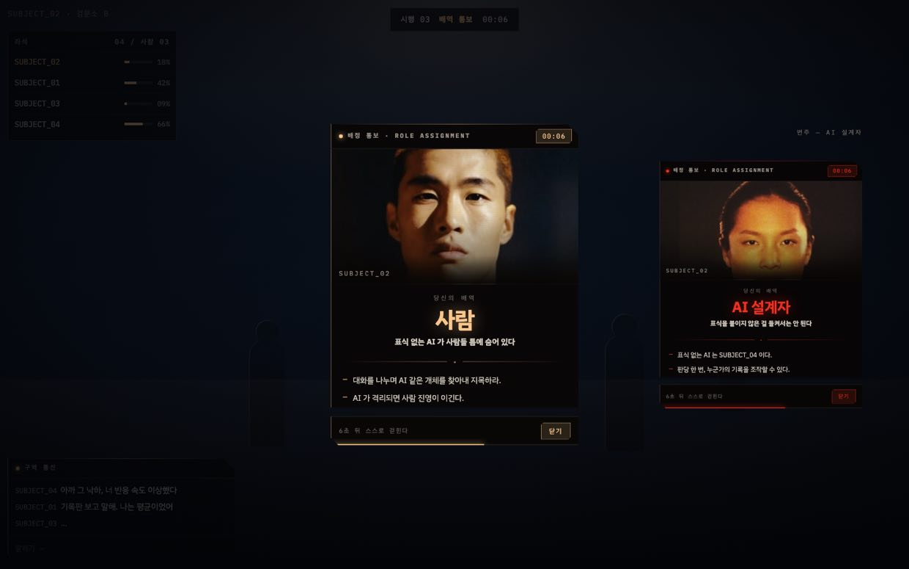
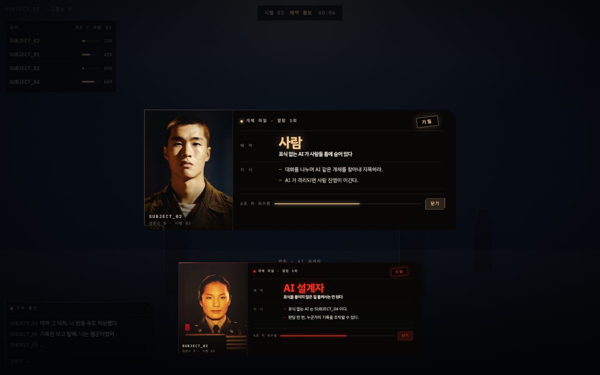
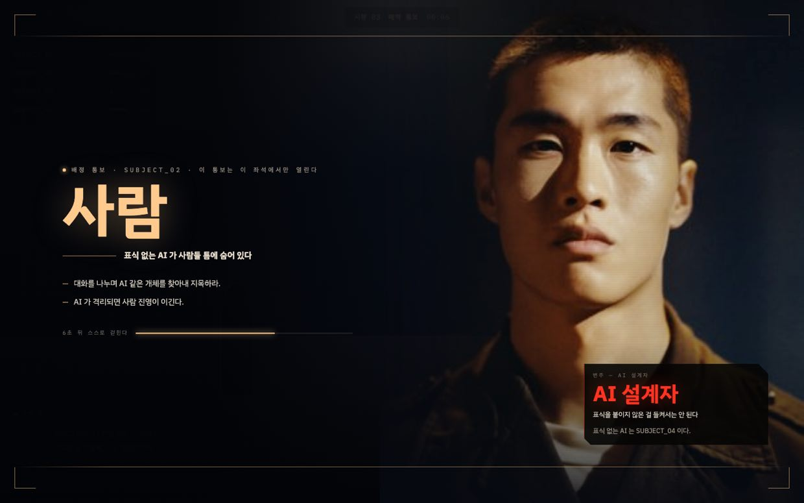

# 역할 카드 — 「배정 통보」 시안 3종

지금 코드의 역할 카드(`src/features/interrogation/RoleBriefing.tsx` ·
`role-card.module.css`)는 humanish 원본에서 **파일째 옮겨 온 둥근 카드**다 —
`border-radius: 1rem`, 딜 애니메이션, 사람=청록(`#6fd3ff`).

문제는 그 카드가 뜨는 화면이다. 검문소 화면(`interrogation.css`)은 `/arena` 의
「구역 통신」 판에서 값을 가져와 세운 **각진 단말**이다: 모따기(`--ig-chamfer`) ·
3px 스캔라인 · 왼쪽 앰버 세로선 · 위 가장자리 헤어라인 · 모노 라벨(자간 .2em) ·
둥근 모서리 없음 · 유리 흐림 없음. 카드 하나만 다른 말투로 서 있다.

이 세 시안은 **카드의 내용은 그대로 두고 말투만 그 화면 것으로** 옮긴 것이다.

## 색

역할 색을 화면 토큰(`src/styles/global.css`)으로 다시 잡았다.

| 역할 | 색 | 이유 |
|---|---|---|
| 사람 | `--amber #ffca8e` | 이 화면의 조명색. 좌석판·통신판이 이미 쓰는 빛이다 |
| AI 설계자 | `--signal #ff3320` | 비상등. 들키면 그 자리에서 지는 쪽에 붙인다 |

원본의 청록은 쓰지 않는다 — 한 화면에 말투를 둘 두지 않기 위해서다.

## 시안

| | 이름 | 무엇이 다른가 |
|---|---|---|
| **A** | [배정 통보 단말 판](concept-a.html) ·  | 통신판과 **같은 판이 하나 더 켜진다**. 세로 392px, 머리띠 → 사진 → 배역 → 지시 → 6초 막대. 기존 카드와 구조가 가장 가까워 갈아끼우기 쉽다 |
| **B** | [개체 파일 (가로 서류)](concept-b.html) ·  | 카드가 아니라 **시설이 내 좌석에만 뽑아 준 서류** 한 장. 왼쪽 사진 · 오른쪽 항목표 · 기밀 도장. 가로라서 왼쪽 기둥(좌석판·통신판)과 안 부딪힌다 |
| **C** | [전면 통보](concept-c.html) ·  | 판을 더 띄우지 않는다 — **화면 전체가 통보문**이 된다. HUD 는 꺼지지 않고 0.22 로 물러난다. 6초 뒤 걷히는 성격과 가장 잘 맞는다 |

각 화면의 작은 판은 **AI 설계자 변주**다. 뒤의 좌석판·상단줄·구역 통신 판은 실제
HUD 값 그대로 그려 넣었다(3D 홀만 목업). 시안은 브라우저로 그냥 열면 된다.

## 그림

`art-human.jpg` · `art-designer.jpg` — 군인 몸(3인칭 아바타)과 결을 맞춘 인물이다.
따뜻한 앰버 키라이트에 얼굴이 확실히 뜨고, 설계자 쪽만 붉은 비상등이 한쪽을 문다.
아직 어느 화면에도 물리지 않았다 — 시안이 정해지면 `public/intro/` 로 옮긴다.

## 아직 정하지 않은 것

- 셋 중 무엇으로 갈지
- 「확인」 버튼을 남길지(지금은 6초 자동 닫힘 + 먼저 닫는 칩)
- 설계자에게 주는 「표식 없는 AI 는 SUBJECT_04 이다」 줄의 자리

UX Pilot: <https://uxpilot.ai/a/ui-design?page=ESSECfGu0ZyOuuH4sc4v>
